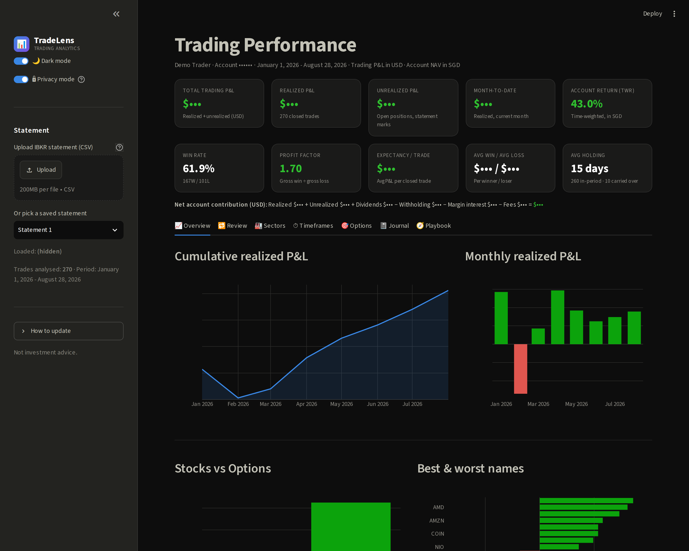
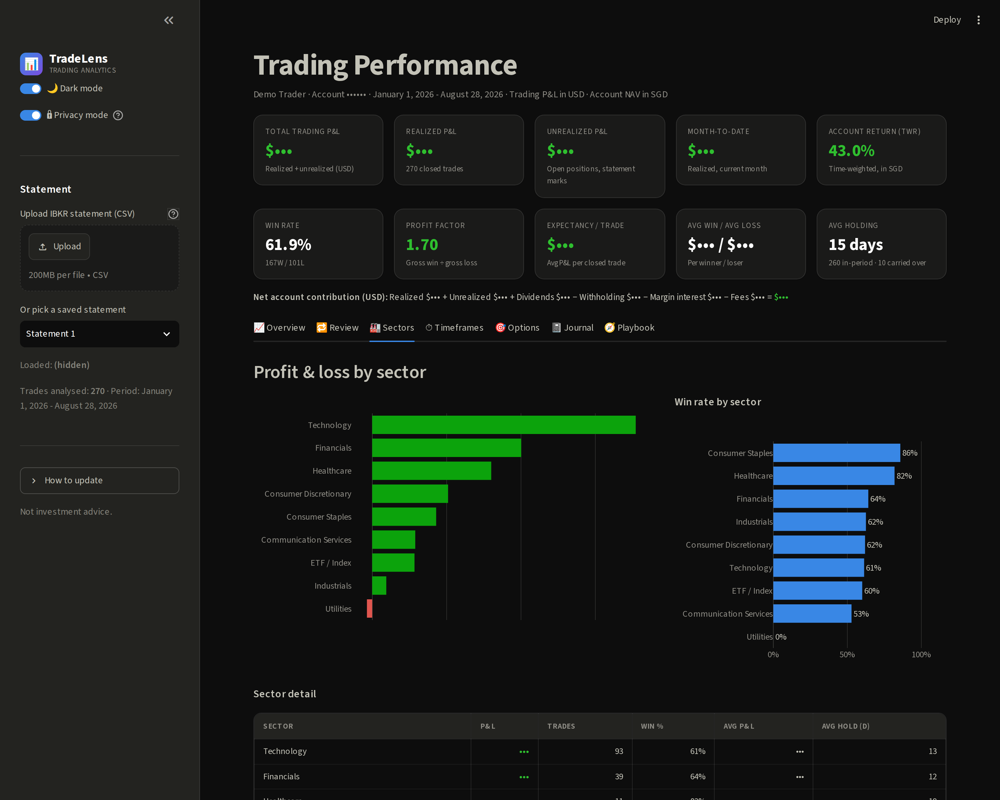
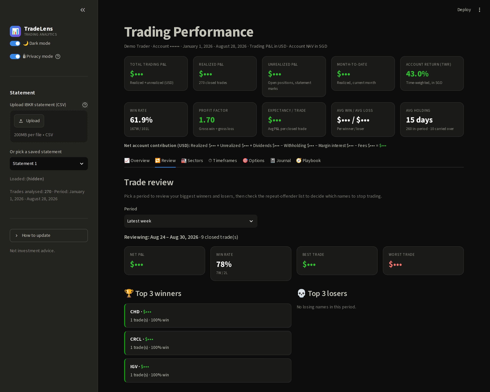
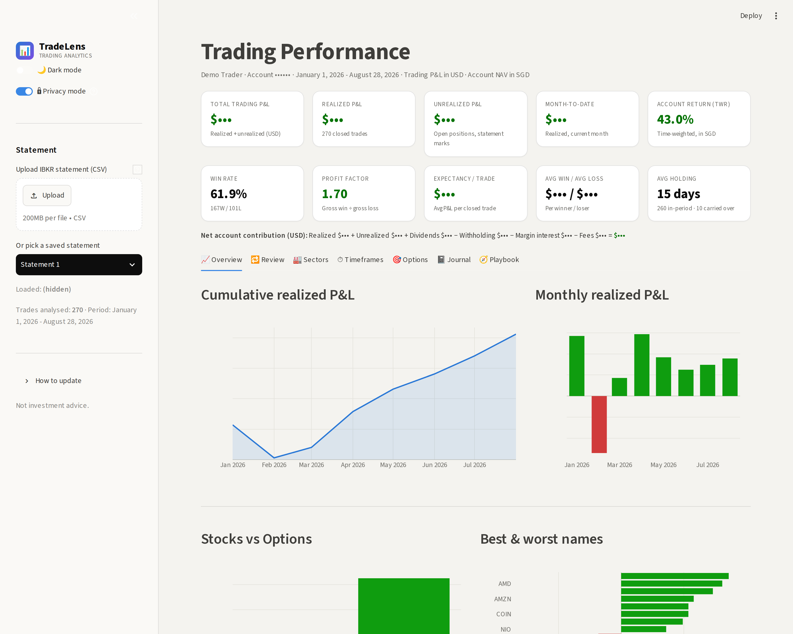

# TradeLens — Trading Performance Analytics

> **TradeLens** is a local, privacy-first Streamlit dashboard that turns an Interactive
> Brokers (IBKR) Activity Statement into a clear picture of how you actually trade. Upload
> your statement and it reconciles your realized P&L to the cent, then breaks your results
> down by stocks vs options, sector, holding period, day of week, and individual name —
> surfacing your genuine strengths and weaknesses, a weekly review console with a
> "repeat-offender" avoid list, a full trade journal, and plain-language recommendations.
> Everything runs on your own machine, nothing is uploaded to any server, and a one-click
> **Privacy mode** masks every dollar amount so you can share screenshots without exposing
> your account. It's not investment advice — just an honest mirror of your trading history.



All trading P&L is in **USD** (the instrument currency of the trades); account-level NAV /
time-weighted return is shown separately in the account **base currency**. A **light / dark
theme toggle** and a **privacy toggle** live in the sidebar.

---

## Screenshots

*All screenshots below use Privacy mode, which hides real dollar amounts and account details.*

| Sectors — strengths & weaknesses | Weekly review — avoid list |
|---|---|
|  |  |

Light theme:



---

## Quick start

**Easiest (Windows):** double-click **`run_dashboard.bat`**. It installs the
dependencies the first time and opens the dashboard in your browser.

**Manual:**
```bash
pip install -r requirements.txt
streamlit run app.py
```
The dashboard opens at http://localhost:8501.

---

## Loading a statement

Two ways, either works:

1. **Upload in-app (any user):** use **Upload IBKR statement** in the sidebar. The file
   is analyzed in-memory and **not saved** — ideal for a shared or one-off use.
2. **Keep a library:** drop `.csv` files into the **`data/`** folder. The sidebar lets
   you pick any of them; the newest loads by default.

To export from IBKR: **Performance & Reports → Statements → Activity**, period
**Year to Date**, format **CSV**. Nothing is hard-coded to a specific statement —
every number, chart, and recommendation recomputes from whichever file is loaded.

---

## The tabs

- **Overview** — headline KPIs, cumulative & monthly P&L, stocks vs options, best/worst names, open positions.
- **Review** — your weekly review console: pick a period (latest week, any week, month, last 30 days, all-time), see the **top 3 winners and top 3 losers**, and check the **repeat-offenders "avoid list"** (names traded 2+ times that are net negative) plus the reliable performers. Exportable to CSV.
- **Sectors** — P&L and win rate by sector, a sector→ticker treemap, and an auto-generated strengths/weaknesses list.
- **Timeframes** — day-trade vs swing vs position, day-of-week patterns (entry & exit), and a holding-period vs P&L scatter.
- **Options** — calls vs puts, every exercise/assignment/expiry, and a full option round-trip table.
- **Journal** — every closed trade (bought date → sold date → profit), filterable by asset/sector/result/symbol, with a **CSV download**.
- **Playbook** — data-driven recommendations plus tailored trading-discipline tips.

## What's in the box

| File | Purpose |
|------|---------|
| `app.py` | The Streamlit dashboard (UI + charts). |
| `ibkr_analytics.py` | Reusable parsing + analytics engine. Parses the multi-section IBKR CSV, matches round-trips (FIFO) for holding periods, and computes all metrics. Import it in a notebook if you want the raw numbers. |
| `sectors.py` | Curated GICS-style sector map for each ticker. Edit this to correct or add a classification. |
| `enrich_sectors.py` | Optional: auto-classify any unknown tickers via Alpha Vantage (needs a free API key). Caches results to `data/sector_cache.json`. |
| `data/` | Drop your IBKR Activity Statement CSVs here. |
| `output/` | Free space for anything you want to export. |
| `.streamlit/config.toml` | Dark theme. |
| `requirements.txt` | Python dependencies. |

## Sectors — how classification works

Each ticker is mapped to a GICS-style sector by a curated table in `sectors.py`
(offline, instant). If a future statement contains a ticker that isn't mapped, it
shows as **Unknown** in the Sectors tab. Two ways to fix that:

1. Add a line to `SECTOR_MAP` in `sectors.py` (e.g. `"XYZ": "Financials",`), or
2. Run `python enrich_sectors.py` after setting a free Alpha Vantage API key —
   it looks up only the unknowns and caches them to `data/sector_cache.json`,
   which the dashboard reads first.

---

## How the numbers are computed (so you can trust them)

- **Realized P&L** uses IBKR's own tax-lot `Realized P/L` figures from the Trades
  section. This reconciles **to the cent** with your statement and correctly handles
  positions carried over from a prior year (bought in 2025, sold in 2026).
- **Unrealized P&L** uses the statement's mark-to-market values from the
  Open Positions section (no external price feed needed — fully offline).
- **Holding period / day-vs-swing** is derived by FIFO-matching each closing
  execution back to its opening execution *within the statement period*. Positions
  opened before the statement window are included in P&L but excluded from
  holding-period stats (their true entry date isn't in the file). The KPI header
  shows how many trades fall into each group.
- **Option events** (exercise / assignment / expiry) are detected from IBKR action
  codes (`Ex`, `A`, `Ep`).

Quick sanity check from the command line:
```bash
python ibkr_analytics.py data/<your_statement>.csv
```

---

## Notes

- Holding-window buckets: Intraday (0d), Short swing (1–5d), Swing (6–20d), Position (>20d).
  Edit `classify_holding()` in `ibkr_analytics.py` to change the thresholds.
- The recommendations panel is generated from your data each run, so it stays correct
  as you upload new statements.
- This is a personal analytics tool, not investment advice.
